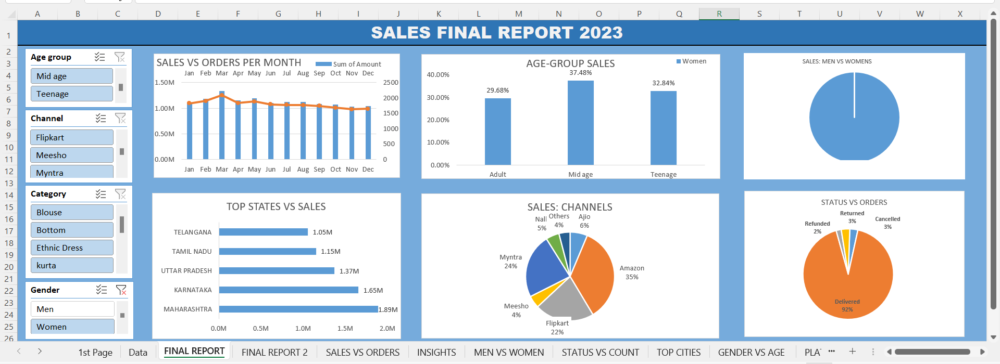

# Store_Warehouse_Analysis  

This project focuses on analyzing the annual sales data of a store to gain insights into various aspects such as profitability based on age groups, gender-based sales, the platform that generated maximum sales, and the top-selling products. The analysis provides valuable information for strategic decision-making and identifying key trends within the store's sales data.  

Table of Contents  
Introduction  
Data  
Project Structure  
Dashboard  
Results  
Conclusion  
  

Introduction  
This project's primary objective is to analyse a store's annual sales data and extract meaningful insights. The analysis focuses on the following key aspects:  

Profitability based on age groups: Identifying which age group contributes the most to the store's profits.  
Gender-based sales: Analyzing sales performance based on gender, i.e., which gender generates more sales.  
Platform analysis: Determining the platform that yields maximum sales, such as online sales, in-store purchases, or other channels.  
Top-selling products: Identifying the best-selling products and their corresponding sales figures.  
This project aims to provide a comprehensive analysis that helps stakeholders make informed decisions to optimize the store's sales and profitability.  

Data  
The analysis is performed using the annual sales data provided by the store. The dataset contains the following information:  

Customer ID  
Age  
Gender  
Platform (e.g., online, in-store)  
Product ID  
Product Name  
Sales Amount  
Order ID	
Cust ID		
Age	  
Age group  	
Date  	
Month  	
Status  	
Channel   	
SKU	Category	  
Size  
Qty	  
currency  	
Amount	  
ship-city	  
ship-state	  
ship-postal-code	  
ship-country	  
B2B  

The data is assumed to be in a structured format, such as a CSV file, and is used as input for the analysis.  

Solution  
Dashboard-  
Introducing our powerful dashboard solution tailored to tackle the provided problem statement. Our interactive dashboard offers comprehensive sales analysis, profitability insights by age group, and detailed breakdowns of gender-based sales and platform performance. Gain deeper understanding and make data-driven decisions with our user-friendly dashboard.  

Objectives-
Profitability based on age groups: Identify the age group(s) that contribute the most to the store's profits.  
Gender-based sales: Analyze the sales performance based on gender and determine which gender generates more sales.  
Platform analysis: Determine the platform that yields maximum sales, such as online, in-store, or other channels.  
Top-selling products: Identify the best-selling products and their corresponding  

Results-  
The analysis provides insights into the following aspects:  
This is the dashboard for male sales, which focuses on analyzing sales performance specifically among male customers. Gain valuable insights into male purchasing behavior, popular products, and revenue generation. Leverage this specialized dashboard to optimize marketing strategies and maximize sales growth within the male demographic.  

The analysis provides insights into the following aspects:  

This is the data dashboard for female sales, which focuses on analyzing sales performance among female customers. Uncover insights into female purchasing behavior, identify top-selling products favored by women, and understand revenue generation within this demographic. Utilize this specialized dashboard to optimize marketing strategies and drive sales growth specifically among female customers.

Conclusion-

  

